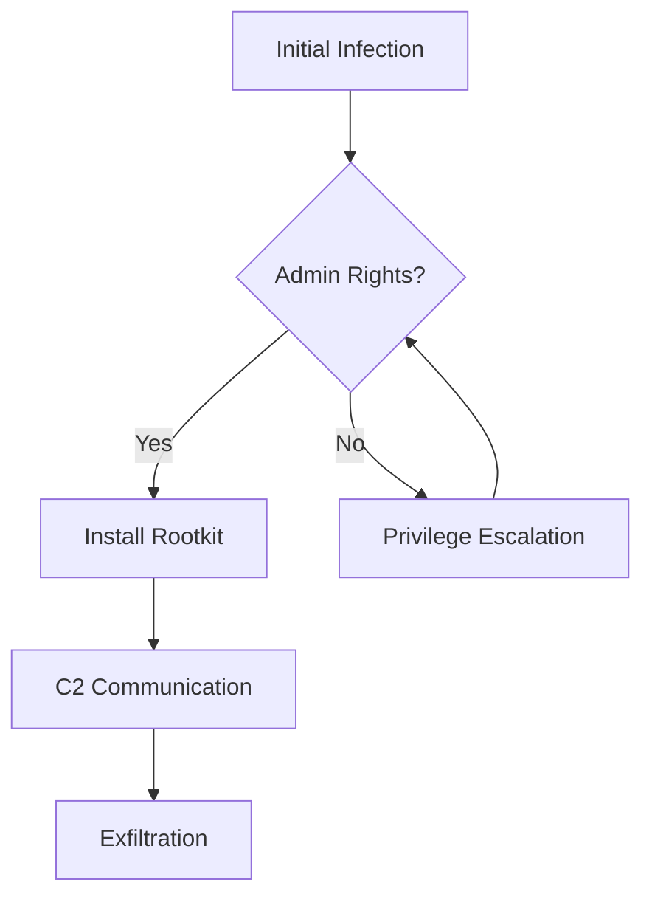

This post demonstrates the rendering engine's ability to handle complex technical content including tables, callouts, and media. For more details on specific techniques, see [[Advanced Malware Techniques]] and related research on [[Behavioral Analysis of State-Sponsored Actors]]. The methodology follows established frameworks [ref:mitre-attack] and industry best practices [ref:nist-800-61].

check [[Gurz]] its perfect.

For detailed technical specifications, see the document below.

[file:demo.pdf|Technical Specification Document]

yeyy :) its cool :D fucking awesome.

# Visual Reconnaissance

Referencing visual data is critical for forensics. See **Figure 1** below for the memory map. This technique is commonly used in [[Advanced Malware Techniques]] for process analysis. The memory analysis approach is based on Volatility Framework [ref:volatility] and documented in academic research [ref:memory-forensics-survey].

## test another section

I love #android and #ai both together.

## yes


### another

cool

# Threat Intelligence Data

We can render structured datasets directly from markdown. For comprehensive threat intelligence, check out the [[NetWatch Intel Feed]] project. The threat actor data is compiled from multiple sources [ref:apt-report-2024] and verified against MITRE ATT&CK matrices [ref:mitre-attack].

| Actor            | Origin      | Primary Target          | Threat Level |
| :--------------- | :---------- | :---------------------- | :----------- |
| **APT28**        | Russia      | Government/Military     | High         |
| **Lazarus**      | North Korea | Financial/Crypto        | Critical     |
| **Volt Typhoon** | China       | Critical Infrastructure | Severe       |

# Operational Warnings

Crucial information is highlighted using semantic blocks. For defensive strategies, see [[Blue Team Operations in Cloud Environments]]. Security best practices are outlined in [ref:owasp-top10] and cloud security frameworks [ref:cisa-cloud-security].

> [!WARNING]
> **OPSEC ALERT:** Always verify the cryptographic signature of these posts before executing any provided shellcode.

> [!INFO]
> **Note:** All malware samples discussed here have been defanged for safety. For hardware-level analysis, see the [[Chimera Firmware Extractor]] project. Firmware analysis techniques are documented in [ref:firmware-security] and hardware security research [ref:hardware-trust].

# Code Analysis

The following code demonstrates header analysis techniques used in malware research. For more advanced reverse engineering, refer to [[Advanced Malware Techniques]]. PE file format specifications are available in [ref:pe-spec] and analysis tools in [ref:pe-tools].

```python
def analyze_header(data):
    # Check for MZ header
    if data[0:2] == b'MZ':
        print("[+] PE Header Detected")
        return True
    return False
```

# Terminal Sessions

We can also display terminal sessions with command highlighting.

```terminal
# Initial Reconnaissance
$ nmap -sV -p- 10.10.10.55
Starting Nmap 7.93 ( https://nmap.org )
Nmap scan report for 10.10.10.55
Host is up (0.032s latency).
Not shown: 65533 closed tcp ports (reset)
PORT   STATE SERVICE VERSION
22/tcp open  ssh     OpenSSH 8.2p1 Ubuntu 4ubuntu0.5 (Ubuntu Linux; protocol 2.0)
80/tcp open  http    Apache httpd 2.4.41 ((Ubuntu))
Service Info: OS: Linux; CPE: cpe:/o:linux:linux_kernel

Service detection performed. Please report any incorrect results at https://nmap.org/submit/ .
Nmap done: 1 IP address (1 host up) scanned in 18.45 seconds
```

# Logic Flow (Mermaid)

We can verify internal logic using graph structures. This attack flow is analyzed in detail in [[Behavioral Analysis of State-Sponsored Actors]]. Attack kill chains are formalized in [ref:lockheed-killchain] and extended in [ref:unified-killchain].



# Video Support

We support inline video embedding for YouTube, Vimeo, and local MP4 files. This is useful for demonstrating proof-of-concepts or recording terminal sessions.

**YouTube Example:**
[video:https://www.youtube.com/watch?v=dQw4w9WgXcQ|Never Gonna Give You Up]

**Vimeo Example:**
[video:https://vimeo.com/148751763|Vimeo Staff Pick]

**Local Video Example:**
[video:demo-reel.mp4|System Demo Reel]

**Asciinema Example (Auto Width/Height):**
[asciinema:11128|Terminal Session Demo]

**Asciinema Example (Another):**
[asciinema:690157|Small Terminal]
[asciinema:659042|Small Terminal]

**YouTube Example:**
[video:https://www.youtube.com/watch?v=dQw4w9WgXcQ|Rick Roll]

# Mathematical Notation (LaTeX)

This platform supports LaTeX for mathematical expressions and formulas. Here are some examples:

**Inline Math:** The probability of detection follows $P(detection) = 1 - e^{-\lambda t}$ where $\lambda$ is the detection rate.

**Display Math:** The entropy calculation for a malware sample can be expressed as:

$$
H(X) = -\sum_{i=1}^{n} p(x_i) \log_2 p(x_i)
$$

Where $H(X)$ represents the Shannon entropy, $p(x_i)$ is the probability of byte value $i$, and $n$ is the total number of possible byte values (256).

**Complex Formula:** The relationship between false positive rate and detection threshold:

$$
FPR(\theta) = \int_{\theta}^{\infty} f_0(x) \, dx = 1 - F_0(\theta)
$$

Where $f_0(x)$ is the probability density function of benign samples and $F_0(\theta)$ is the cumulative distribution function at threshold $\theta$.

These mathematical notations are essential for describing cryptographic operations, statistical analysis, and algorithmic complexity in security research. Cryptographic standards are defined in [ref:nist-crypto] and entropy analysis methods in [ref:shannon-entropy].

# Image Gallery

We support automatic image galleries when images are placed on consecutive lines.

## 2 Images (Split View)


## 3 Images (1 Top, 2 Bottom)


## 4 Images (1 Top, Others Thumbnails)


# Dynamic Queries

We can query the vault data dynamically to show related projects or posts.

```query
type: project
status: active
sort: updated desc
limit: 5
```
